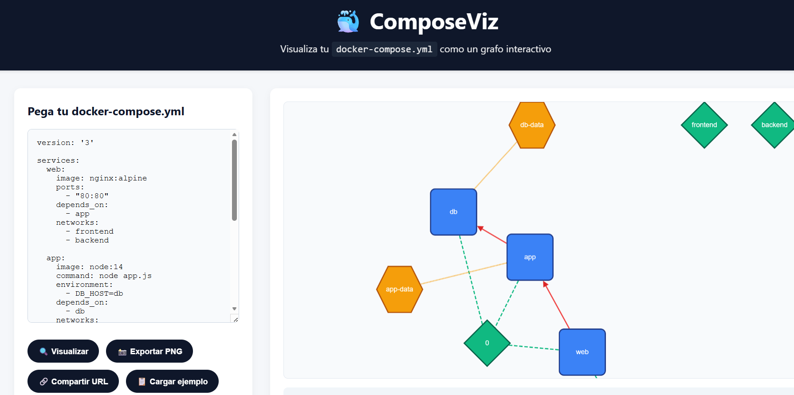

# ComposeViz 🐳📊

**ComposeViz** es una herramienta web que convierte tu archivo `docker-compose.yml` en un gráfico interactivo. Visualiza servicios, dependencias, redes y volúmenes de un vistazo. Ideal para revisar configuraciones complejas, aprender Docker Compose o compartir diagramas con tu equipo.

 *(pendiente de captura)*

---

## ✨ Características

- **Pega tu docker-compose.yml** y obtén el grafo al instante.
- **Sube un archivo** directamente desde tu ordenador.
- **Visualización interactiva**: arrastra, haz zoom, haz clic en los nodos para ver detalles (puertos, variables de entorno, etc.).
- **Dependencias** (`depends_on`) representadas como flechas.
- **Redes y volúmenes** como grupos de nodos.
- **Exporta como imagen** (PNG) con un clic.
- **Comparte tu gráfico** mediante URL: los datos se guardan en el fragmento de la URL (sin servidor).
- **Ejemplos precargados** para probar (WordPress, microservicios, etc.).
- **Totalmente gratuito**, código abierto, y sin backend: todo corre en tu navegador.

---

## 🚀 Uso

### Online (recomendado)
 (cuando esté publicado).

### Localmente
1. Clona el repositorio:
   ```bash
   git clone https://github.com/tu-usuario/composeviz.git
   cd composeviz
Abre index.html en tu navegador (no necesita servidor).

## Instrucciones
Pega el contenido de tu docker-compose.yml en el área de texto, o haz clic en "Subir archivo" para seleccionar un archivo.

Haz clic en "Visualizar".

Explora el grafo: haz clic en los nodos para ver detalles.

Usa el botón "Exportar PNG" para guardar la imagen.

Comparte la URL actual: el gráfico está codificado en la dirección (ej. https://.../#yaml=...).

## 📖 Ejemplo
Entrada (docker-compose.yml):

yaml
version: '3'
services:
  web:
    image: nginx
    ports:
      - "80:80"
    depends_on:
      - app
  app:
    image: myapp
    environment:
      - DB_HOST=db
    depends_on:
      - db
  db:
    image: postgres
    volumes:
      - db-data:/var/lib/postgresql/data

volumes:
  db-data:
Salida visual:
https://assets/example-graph.png (pendiente)

🛠️ Tecnologías
HTML5 / CSS3

JavaScript (ES6)

Cytoscape.js para la visualización de grafos

js-yaml para parsear YAML en el navegador

FileSaver.js para guardar la imagen

📁 Estructura del proyecto
text
composeviz/
├── index.html          # Página principal
├── css/
│   └── style.css       # Estilos personalizados
├── js/
│   └── main.js         # Lógica de la aplicación (parseo, grafo, eventos)
├── assets/             # Imágenes, iconos, etc.
│   └── demo.png        # Captura de pantalla para el README
└── README.md           # Este archivo

## 🤝 Contribuir

¿Se te ocurre una mejora? ¿Quieres añadir más ejemplos o personalizar los estilos del grafo? ¡Las contribuciones son bienvenidas!

Haz un fork del proyecto.

Crea una rama (git checkout -b feature/nueva-funcionalidad).

Haz commit de tus cambios.

Sube la rama y abre un Pull Request.

## 📄 Licencia
MIT © AlejandroGlezSan